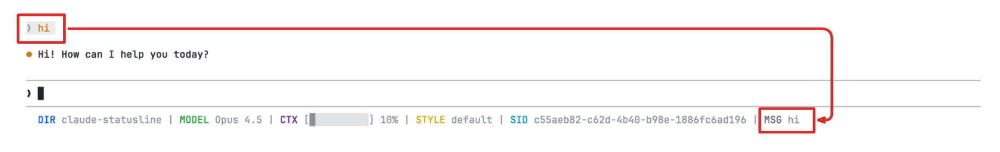

# @devstefancho/claude-statusline

Claude Code CLI를 위한 커스텀 statusline 설정을 간편하게 설치할 수 있는 npx 패키지입니다.

## Screenshot



## Features

statusline은 다음 정보를 표시합니다:
- **DIR**: 현재 작업 디렉토리 (git 기준 상대경로)
- **MODEL**: 사용 중인 Claude 모델
- **CTX**: Context window 사용률 (프로그레스 바)
- **STYLE**: 출력 스타일
- **SID**: 세션 ID
- **MSG**: 마지막 사용자 메시지 (미리보기)

## Supported Platforms

| Platform | Script | Dependencies |
|----------|--------|--------------|
| macOS / Linux | `claude-statusline.sh` (Bash) | jq (required), python3, git |
| Windows | `claude-statusline.ps1` (PowerShell) | python (optional), git |

## Installation

```bash
npx @devstefancho/claude-statusline install
```

### Options

```bash
# 강제 설치 (기존 파일 덮어쓰기)
npx @devstefancho/claude-statusline install --force

# 기존 파일 백업 후 설치
npx @devstefancho/claude-statusline install --backup
```

## Commands

### install

statusline 설정을 설치합니다.

```bash
npx @devstefancho/claude-statusline install [options]
```

| 옵션 | 설명 |
|------|------|
| `-f, --force` | 기존 파일 덮어쓰기 |
| `-b, --backup` | 기존 파일 백업 후 설치 |

### uninstall

statusline 설정을 제거합니다.

```bash
npx @devstefancho/claude-statusline uninstall [options]
```

| 옵션 | 설명 |
|------|------|
| `--keep-script` | 스크립트 파일은 유지하고 설정만 제거 |

### status

현재 설치 상태를 확인합니다.

```bash
npx @devstefancho/claude-statusline status
```

## Requirements

### macOS / Linux

#### 필수
- **jq**: JSON 파싱을 위해 필요
  ```bash
  # macOS
  brew install jq

  # Ubuntu/Debian
  apt install jq
  ```

#### 권장
- **python3**: 상대 경로 계산에 사용
- **git**: git 저장소 기준 경로 표시에 사용

### Windows

Windows에서는 PowerShell 스크립트를 사용하므로 **jq가 필요하지 않습니다**.

#### 권장
- **python**: 상대 경로 계산에 사용 (없으면 PowerShell 내장 함수 사용)
- **git**: git 저장소 기준 경로 표시에 사용

## How It Works

1. 플랫폼에 맞는 스크립트 파일 설치:
   - macOS/Linux: `~/.claude/claude-statusline.sh`
   - Windows: `%USERPROFILE%\.claude\claude-statusline.ps1`
2. `~/.claude/settings.json`에 statusLine 설정 추가

설치 후 Claude Code를 재시작하면 statusline이 적용됩니다.

## Customization

설치 후 스크립트 파일을 직접 수정하여 statusline을 커스터마이즈할 수 있습니다.

```bash
# macOS/Linux
vim ~/.claude/claude-statusline.sh

# Windows (PowerShell)
notepad $env:USERPROFILE\.claude\claude-statusline.ps1
```

## Uninstallation

```bash
# 완전 제거
npx @devstefancho/claude-statusline uninstall

# 설정만 제거 (스크립트는 유지)
npx @devstefancho/claude-statusline uninstall --keep-script
```

## License

MIT
