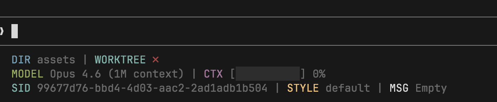
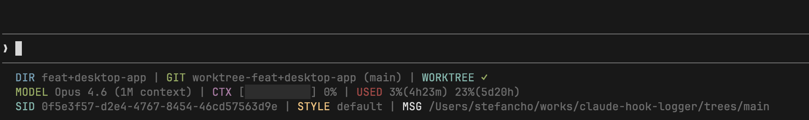

**English** | [한국어](README.ko.md)

# @devstefancho/claude-statusline

An npx package for easily installing custom statusline configuration for Claude Code CLI.

## Screenshot

### Without Worktree


### With Worktree


## Features

Two layout modes are available:

**Multi-line (default)** — 3 lines grouped by meaning:

```
 DIR repo/src | GIT main (main) ↑2↓3 ?3 +2 ~4 -1 !1 | WORKTREE ✓
 MODEL Opus 4.6 (1M context) | CTX [████░░░░░░] 8% | USED 64%(0h1m) 23%(5d21h) | LINES +42 -15
 SID a5bc4601... | STYLE default | MSG hi
```

**Compact** — everything on a single line:

```
 45% | [✓ repo/src  main ↑2 ~1  +42/-15] | Opus 4.7 1M | 60%(2h30m) 20%(3d5h)
```

In compact mode:
- `ctx` shows only `NN%`, colored by model context window size
  - 1M context model: gray <30%, yellow 30–50%, red ≥50%
  - Standard model: gray <50%, yellow 50–80%, red ≥80%
- `model` drops the `Claude ` prefix
- `used` drops the `USED` / `5h` / `7d` labels (order is fixed: 5-hour first, 7-day second)
- `proj` groups `dir`, worktree (`✓` prefix when inside), `git`, and lines-changed into one bracketed segment

### Available Items

| Item | Description | Default Line |
|------|-------------|:------------:|
| `dir` | Current working directory (relative path from git root) | 1 |
| `git` | Branch, ahead/behind, file status (untracked/staged/modified/deleted/conflicts) | 1 |
| `worktree` | Worktree indicator — `✓` (green) / `✗` (red) | 1 |
| `proj` | Combined dir + worktree + git + lines-changed in a bracketed group (for compact mode) | 1 |
| `model` | Active Claude model name | 2 |
| `ctx` | Context window usage (progress bar, or `NN%` in compact) | 2 |
| `used` | Rate limit usage (5-hour / 7-day with remaining time) | 2 |
| `lines` | Lines added/removed in session (`+42 -15`) | 2 |
| `sid` | Session ID | 3 |
| `style` | Output style | 3 |
| `msg` | Last user message (preview, truncated to 200 chars) | 3 |

All items can be toggled on/off and assigned to any line (1, 2, or 3) via interactive install.

## Supported Platforms

| Platform | Script | Dependencies |
|----------|--------|--------------|
| macOS / Linux | `claude-statusline.sh` (Bash) | jq (required), python3, git |
| Windows | `claude-statusline.ps1` (PowerShell) | python (optional), git |

## Installation

### Install directly from GitHub (not published to npm)

```bash
npx github:devstefancho/claude-statusline install
```

### Install from npm (after publishing)

```bash
npx @devstefancho/claude-statusline install
```

### Compact Install

Install the compact single-line preset directly:

```bash
npx @devstefancho/claude-statusline install --compact
```

### Interactive Install

Pick a preset (compact / multi-line / custom), or customize items and line assignments:

```bash
npx @devstefancho/claude-statusline install -i
```

The interactive mode lets you:
1. **Choose a preset** — Compact (single line), Multi-line (three lines), or Custom
2. **Select items** (Custom only) — Toggle items on/off with space, toggle all with `a`
3. **Assign lines** (Custom only) — Place each item on Line 1, 2, or 3 (or use the default layout)

Your choices are saved to `~/.claude/statusline-config.json` and the scripts read this config at runtime.

### Options

```bash
# Force install (overwrite existing files)
npx @devstefancho/claude-statusline install --force

# Backup existing files before install
npx @devstefancho/claude-statusline install --backup

# Install compact single-line preset
npx @devstefancho/claude-statusline install --compact

# Interactive preset / item / layout selection
npx @devstefancho/claude-statusline install -i

# Skip interactive mode, use default (multi-line) layout
npx @devstefancho/claude-statusline install --default
```

## Commands

### install

Installs the statusline configuration.

```bash
npx @devstefancho/claude-statusline install [options]
```

| Option | Description |
|--------|-------------|
| `-f, --force` | Overwrite existing files |
| `-b, --backup` | Backup existing files before install |
| `-i, --interactive` | Interactively select preset, items and line layout |
| `-c, --compact` | Install compact single-line preset |
| `--default` | Skip interactive mode, use default (multi-line) layout |

### uninstall

Removes the statusline configuration.

```bash
npx @devstefancho/claude-statusline uninstall [options]
```

| Option | Description |
|--------|-------------|
| `--keep-script` | Keep script file, only remove settings |

### status

Check current installation status, including layout configuration.

```bash
npx @devstefancho/claude-statusline status
```

## Requirements

### macOS / Linux

#### Required
- **jq**: Required for JSON parsing
  ```bash
  # macOS
  brew install jq

  # Ubuntu/Debian
  apt install jq
  ```

#### Recommended
- **python3**: Used for relative path calculation
- **git**: Used for git-relative path display

### Windows

Windows uses a PowerShell script, so **jq is not required**.

#### Recommended
- **python**: Used for relative path calculation (falls back to PowerShell built-in function if unavailable)
- **git**: Used for git-relative path display

## How It Works

1. Installs platform-specific script file:
   - macOS/Linux: `~/.claude/claude-statusline.sh`
   - Windows: `%USERPROFILE%\.claude\claude-statusline.ps1`
2. Saves layout config to `~/.claude/statusline-config.json`
3. Adds statusLine configuration to `~/.claude/settings.json`

Restart Claude Code after installation to apply the statusline.

## Customization

### Via Interactive Install

Re-run with `--force` and `-i` to reconfigure items and layout:

```bash
npx @devstefancho/claude-statusline install --force -i
```

### Via Config File

Edit the layout config directly:

```bash
vim ~/.claude/statusline-config.json
```

Example config (multi-line):
```json
{
  "version": 1,
  "compact": false,
  "layout": {
    "line1": ["dir", "git", "worktree"],
    "line2": ["model", "ctx", "used", "lines"],
    "line3": ["sid", "style", "msg"]
  }
}
```

Example config (compact):
```json
{
  "version": 1,
  "compact": true,
  "layout": {
    "line1": ["ctx", "proj", "model", "used"],
    "line2": [],
    "line3": []
  }
}
```

The `compact` flag changes how `ctx`, `model`, and `used` render (labels stripped, thresholded colors for `ctx`).

### Via Script File

You can also edit the script file directly for advanced customization:

```bash
# macOS/Linux
vim ~/.claude/claude-statusline.sh

# Windows (PowerShell)
notepad $env:USERPROFILE\.claude\claude-statusline.ps1
```

## Uninstallation

```bash
# Complete removal
npx @devstefancho/claude-statusline uninstall

# Remove settings only (keep script)
npx @devstefancho/claude-statusline uninstall --keep-script
```

## License

MIT
